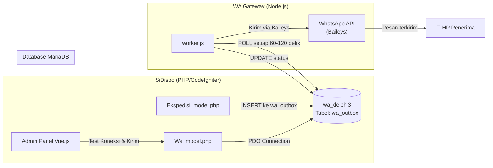
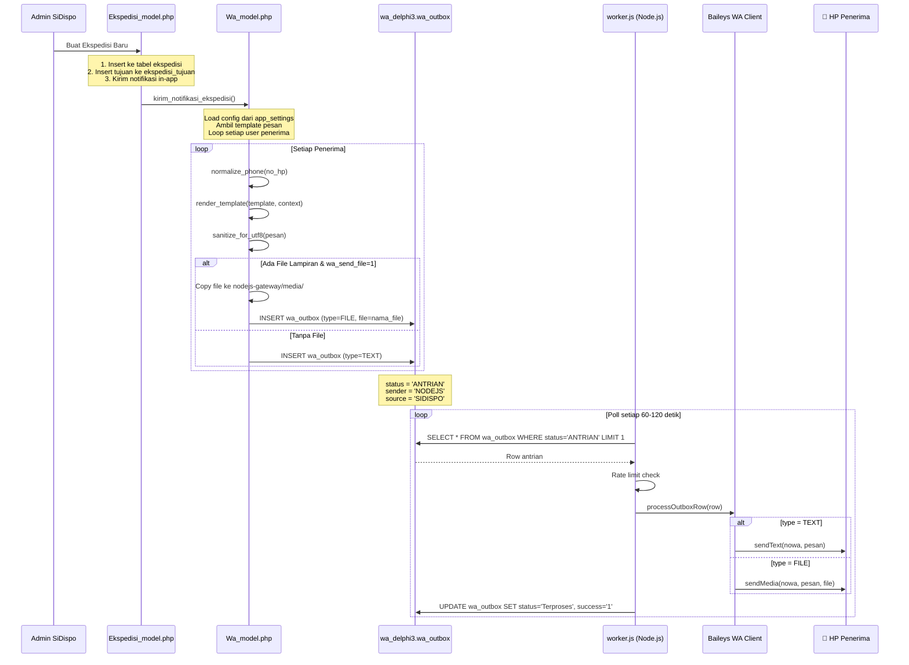
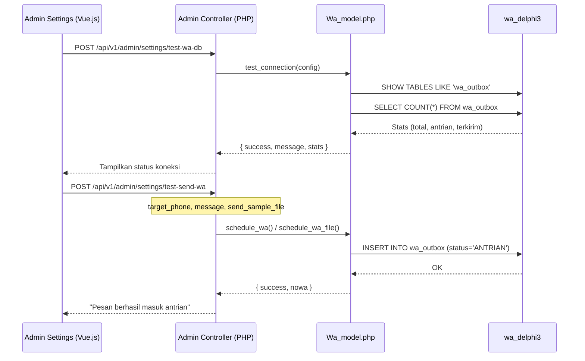
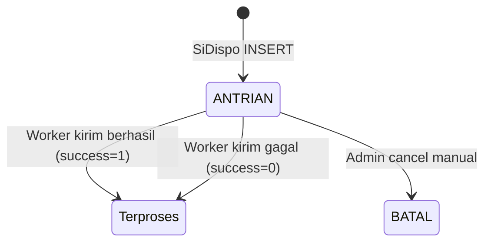
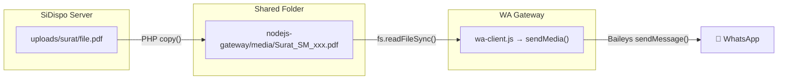
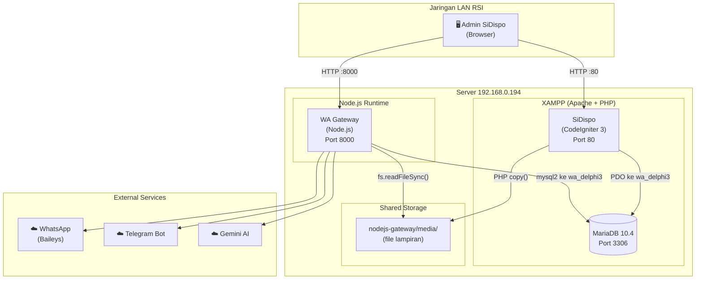

# Dokumentasi Integrasi SiDispo ↔ WA Gateway (Node.js)

## Ringkasan Arsitektur

Integrasi antara **SiDispo** (Sistem Informasi Disposisi) dan **WA Gateway Node.js** menggunakan pola **Shared Database Queue** (antrian via tabel bersama). Kedua sistem **tidak berkomunikasi langsung via HTTP/API**, melainkan melalui satu tabel antrian bernama `wa_outbox` di database MariaDB `wa_delphi3`.



---

## Komponen Sistem

### 1. SiDispo (Producer / Pengirim)

| Komponen | Path | Fungsi |
|---|---|---|
| **Wa_model.php** | [`application/models/Wa_model.php`](file:///c:/xampp/htdocs/SiDispo/application/models/Wa_model.php) | Model utama integrasi WA — koneksi DB, normalisasi nomor, insert antrian, render template |
| **Ekspedisi_model.php** | [`application/models/Ekspedisi_model.php`](file:///c:/xampp/htdocs/SiDispo/application/models/Ekspedisi_model.php) | Trigger otomatis kirim WA saat ekspedisi dibuat |
| **Admin.php** | [`application/controllers/Admin.php`](file:///c:/xampp/htdocs/SiDispo/application/controllers/Admin.php) | Endpoint admin: test koneksi DB WA, test kirim pesan |
| **AdminSettingsView.vue** | [`sidispo-frontend/src/views/AdminSettingsView.vue`](file:///c:/xampp/htdocs/SiDispo/sidispo-frontend/src/views/AdminSettingsView.vue) | UI konfigurasi WA Gateway di panel admin |

### 2. WA Gateway Node.js (Consumer / Pengirim Aktual)

| Komponen | Path | Fungsi |
|---|---|---|
| **index.js** | [`gateway-node/src/index.js`](file:///c:/xampp/htdocs/nodejs-gateway/gateway-node/src/index.js) | Entry point — inisialisasi DB, WA client, worker, API server |
| **worker.js** | [`gateway-node/src/worker.js`](file:///c:/xampp/htdocs/nodejs-gateway/gateway-node/src/worker.js) | Polling loop — ambil pesan dari `wa_outbox`, kirim, update status |
| **wa-client.js** | [`gateway-node/src/wa-client.js`](file:///c:/xampp/htdocs/nodejs-gateway/gateway-node/src/wa-client.js) | Koneksi WhatsApp via Baileys library — kirim teks, media, file |
| **db.js** | [`gateway-node/src/db.js`](file:///c:/xampp/htdocs/nodejs-gateway/gateway-node/src/db.js) | Database layer — fetchNextMessage, markProcessed, insertMessage |
| **bot.js** | [`gateway-node/src/bot.js`](file:///c:/xampp/htdocs/nodejs-gateway/gateway-node/src/bot.js) | Auto-reply bot (jadwal poli, knowledge base, Gemini AI) |
| **config.js** | [`gateway-node/src/config.js`](file:///c:/xampp/htdocs/nodejs-gateway/gateway-node/src/config.js) | Konfigurasi dari `.env` |

### 3. Database Penghubung

| Database | Tabel | Fungsi |
|---|---|---|
| `wa_delphi3` | `wa_outbox` | **Antrian pesan utama** — tabel bridge antara SiDispo dan WA Gateway |
| `wa_delphi3` | `wa_jadwal` | Jadwal poli/dokter (file gambar/PDF) untuk auto-reply bot |
| `wa_delphi3` | `wa_notes` | Knowledge base admin untuk auto-reply bot |
| `wa_delphi3` | `wa_client_specs` | Spesifikasi komputer client (integrasi n8n/Telegram) |

---

## Alur Integrasi Detail

### Alur 1: Notifikasi Ekspedisi Surat Masuk (Alur Utama)

Ini adalah alur utama dan paling penting — saat admin mengirim ekspedisi surat ke unit-unit penerima, sistem otomatis mengirim notifikasi WhatsApp ke setiap penerima yang memiliki nomor HP.



#### Langkah-langkah Detail:

**Tahap 1 — SiDispo INSERT ke Antrian** (sisi PHP)

1. Admin membuat ekspedisi baru via UI ([`Ekspedisi_model.php:302-379`](file:///c:/xampp/htdocs/SiDispo/application/models/Ekspedisi_model.php#L302-L379))
2. Setelah transaksi DB berhasil, sistem memanggil `Wa_model::kirim_notifikasi_ekspedisi()` ([`Wa_model.php:353-464`](file:///c:/xampp/htdocs/SiDispo/application/models/Wa_model.php#L353-L464))
3. Wa_model membaca konfigurasi dari `app_settings` (host, port, user, pass database WA)
4. Untuk setiap user penerima yang punya `no_hp`:
   - Nomor dinormalisasi ke format `08xxxxxxxxx@c.us` ([`Wa_model.php:136-153`](file:///c:/xampp/htdocs/SiDispo/application/models/Wa_model.php#L136-L153))
   - Template pesan di-render dengan data ekspedisi/surat
   - Emoji 4-byte disanitasi agar kompatibel dengan charset utf8 (3-byte) ([`Wa_model.php:158-170`](file:///c:/xampp/htdocs/SiDispo/application/models/Wa_model.php#L158-L170))
   - Jika ada file lampiran & `wa_send_file=1`:
     - File disalin dari `uploads/surat/` ke `nodejs-gateway/media/` ([`Wa_model.php:259-291`](file:///c:/xampp/htdocs/SiDispo/application/models/Wa_model.php#L259-L291))
     - Insert ke `wa_outbox` dengan `type=FILE` dan `file=nama_file`
   - Jika tanpa file: Insert `type=TEXT`
5. Record di `wa_outbox` disimpan dengan:
   - `status = 'ANTRIAN'`
   - `sender = 'NODEJS'`
   - `source = 'SIDISPO'`

**Tahap 2 — WA Gateway Polling & Kirim** (sisi Node.js)

1. [`worker.js`](file:///c:/xampp/htdocs/nodejs-gateway/gateway-node/src/worker.js#L49-L121) melakukan polling setiap 60-120 detik (random interval)
2. Sebelum poll, worker cek: DB connected? License valid? WA ready? Dalam jam operasional?
3. Query: `SELECT FROM wa_outbox WHERE status='ANTRIAN' AND sender IN ('NODEJS','DELPHI','QISCUS','ANY') ORDER BY tanggal_jam ASC LIMIT 1`
4. Cek rate limit (max 500/jam global, max 30/jam per nomor)
5. Panggil [`processOutboxRow()`](file:///c:/xampp/htdocs/nodejs-gateway/gateway-node/src/wa-client.js#L320-L338):
   - `TEXT` → `sendText(nowa, pesan)` via Baileys
   - `FILE` → `sendMedia(nowa, pesan, file)` — baca file dari `media/` folder
6. Setelah terkirim: `UPDATE wa_outbox SET status='Terproses', success='1', sent_datetime=NOW()`
7. Jika gagal: `success='0'`, `response=error_message`

---

### Alur 2: Test Koneksi & Kirim Manual (Admin Panel)



**Endpoint Admin:**

| Method | Endpoint | Fungsi |
|---|---|---|
| `POST` | `/api/v1/admin/settings/test-wa-db` | Test koneksi ke database `wa_delphi3` |
| `POST` | `/api/v1/admin/settings/test-send-wa` | Kirim pesan uji coba ke antrian `wa_outbox` |
| `PUT` | `/api/v1/admin/settings` | Simpan semua konfigurasi WA ke `app_settings` |

---

## Skema Tabel Penghubung: `wa_outbox`

Tabel ini adalah **"jembatan"** antara SiDispo dan WA Gateway. Strukturnya:

| Kolom | Tipe | Keterangan |
|---|---|---|
| `nomor` | `BIGINT(20) PK AI` | ID auto-increment |
| `nowa` | `VARCHAR(50)` | Nomor WhatsApp tujuan (format: `08xxx@c.us` dari SiDispo, dinormalisasi ke `62xxx` oleh Gateway) |
| `pesan` | `TEXT` | Isi pesan WhatsApp |
| `tanggal_jam` | `DATETIME` | Jadwal kirim (NULL = kirim segera) |
| `status` | `VARCHAR(20)` | Status: `ANTRIAN` → `Terproses` / `BATAL` |
| `source` | `VARCHAR(50)` | Asal pesan: `SIDISPO`, `api`, dll |
| `sender` | `VARCHAR(10)` | Gateway pengirim: `NODEJS`, `DELPHI`, `QISCUS`, `ANY` |
| `success` | `VARCHAR(1)` | Hasil kirim: `1` = sukses, `0` = gagal |
| `response` | `LONGTEXT` | Response JSON dari WhatsApp |
| `sender_name` | `VARCHAR(50)` | Nama gateway yang memproses: `WA-GATEWAY-NODE` |
| `request` | `TEXT` | Detail request: `sendText:nowa` atau `sendMedia:nowa:file` |
| `type` | `VARCHAR(10)` | Tipe pesan: `TEXT`, `FILE`, `IMAGE`, `VIDEO` |
| `file` | `VARCHAR(100)` | Nama file di folder `media/` (untuk tipe FILE) |
| `sent_datetime` | `DATETIME` | Waktu aktual pesan terkirim |

### Lifecycle Status:



---

## Konfigurasi Integrasi

### Sisi SiDispo (`app_settings`)

Konfigurasi disimpan di tabel `app_settings` database `sidispo` dan bisa diubah via Admin Panel:

| Setting Key | Default | Keterangan |
|---|---|---|
| `wa_enabled` | `1` | Master switch — `0` = matikan semua notifikasi WA |
| `wa_db_host` | `192.168.0.194` | Host database WA Gateway |
| `wa_db_port` | `3306` | Port MariaDB |
| `wa_db_user` | `root` | Username database |
| `wa_db_pass` | `bismillah` | Password database |
| `wa_db_name` | `wa_delphi3` | Nama database WA Gateway |
| `wa_outbox_table` | `wa_outbox` | Nama tabel antrian |
| `wa_sender` | `NODEJS` | Sender tag agar Gateway mengenali pesan |
| `wa_source` | `SIDISPO` | Source tag untuk tracking asal pesan |
| `wa_media_path` | `c:/xampp/htdocs/nodejs-gateway/media` | Folder tujuan file lampiran |
| `wa_send_file` | `1` | `1` = kirim file lampiran bersama pesan |
| `wa_template_ekspedisi` | *(template default)* | Template pesan notifikasi WhatsApp |

### Sisi WA Gateway (`.env`)

File: [`gateway-node/.env`](file:///c:/xampp/htdocs/nodejs-gateway/gateway-node/.env)

| Variable | Nilai | Keterangan |
|---|---|---|
| `DB_HOST` | `localhost` | Host database MariaDB |
| `DB_PORT` | `3306` | Port MariaDB |
| `DB_USER` | `root` | Username |
| `DB_PASSWORD` | `bismillah` | Password |
| `DB_NAME` | `wa_delphi3` | Database yang sama dengan konfigurasi SiDispo |
| `SENDERS` | `NODEJS,DELPHI,QISCUS,ANY` | Sender yang diproses oleh worker |
| `POLL_INTERVAL_MIN` | `60` | Interval polling minimum (detik) |
| `POLL_INTERVAL_MAX` | `120` | Interval polling maximum (detik) |
| `MEDIA_DIR` | `../media` | Folder file media (shared dengan SiDispo) |
| `API_PORT` | `8000` | Port REST API Gateway |
| `WA_RATE_MAX_PER_HOUR` | `500` | Batas pesan global per jam |
| `WA_RATE_MAX_PER_NUMBER` | `30` | Batas pesan per nomor per jam |

---

## Mekanisme File Sharing

Saat notifikasi WA menyertakan file lampiran dokumen (PDF surat masuk), prosesnya:



1. **SiDispo** menyalin file dari `uploads/surat/` ke `nodejs-gateway/media/` via PHP `copy()` ([`Wa_model.php:286-291`](file:///c:/xampp/htdocs/SiDispo/application/models/Wa_model.php#L286-L291))
2. Nama file di-rename menjadi format rapi: `Surat_{NoAgenda}_{NamaAsli}.pdf`
3. Nama file disimpan di kolom `file` tabel `wa_outbox`
4. **WA Gateway** membaca file dari `media/` folder dan mengirim via Baileys ([`wa-client.js:224-266`](file:///c:/xampp/htdocs/nodejs-gateway/gateway-node/src/wa-client.js#L224-L266))

> [!IMPORTANT]
> Folder `nodejs-gateway/media/` harus **bisa diakses oleh kedua sistem** (SiDispo menulis, Gateway membaca). Pada deployment saat ini keduanya di server yang sama (`192.168.0.194`), sehingga path lokal bisa dipakai langsung.

---

## Format Nomor WhatsApp

Ada **perbedaan format** antara SiDispo dan WA Gateway:

| Tahap | Format | Contoh |
|---|---|---|
| **Input user (SiDispo)** | 08xxx / +62xxx | `082231857602` |
| **Wa_model normalize** | `08xxx@c.us` | `082231857602@c.us` |
| **wa_outbox.nowa** | `08xxx@c.us` | `082231857602@c.us` |
| **Gateway normalizeNowa** | `62xxx` | `6282231857602` |
| **Baileys toJid** | `62xxx@s.whatsapp.net` | `6282231857602@s.whatsapp.net` |

Normalisasi berjalan dua kali:
1. **SiDispo** (`Wa_model::normalize_phone`) → `08xxx@c.us` ([`Wa_model.php:136-153`](file:///c:/xampp/htdocs/SiDispo/application/models/Wa_model.php#L136-L153))
2. **Gateway** (`db.js::normalizeNowa`) → `62xxx` (tanpa suffix) ([`db.js:9-32`](file:///c:/xampp/htdocs/nodejs-gateway/gateway-node/src/db.js#L9-L32))

> [!NOTE]
> Kedua normalisasi saling kompatibel — Gateway secara otomatis mengkonversi format `08xxx@c.us` menjadi `6282231857602@s.whatsapp.net` sebelum kirim via Baileys.

---

## Template Pesan WhatsApp

Template default ([`Wa_model.php:45-64`](file:///c:/xampp/htdocs/SiDispo/application/models/Wa_model.php#L45-L64)):

```
*NOTIFIKASI EKSPEDISI SURAT MASUK*
{nama_rs}

Yth. *{nama_penerima}*
({jabatan} - {unit})

Dokumen resmi disposisi telah diekspedisikan kepada Anda dengan rincian:
----------------------------------------
- *No. Ekspedisi:* {nomor_ekspedisi}
- *No. Surat:* {nomor_surat}
- *Asal Surat:* {asal_surat}
- *Perihal:* {perihal}
- *Tanggal Kirim:* {tanggal_kirim}
- *Jenis Pengiriman:* {jenis_pengiriman}
{catatan_pengiriman}
----------------------------------------
{keterangan_tambahan}

Silakan akses sistem *SiDispo* pada menu *Ekspedisi Masuk*...
```

### Placeholder yang Tersedia:

| Placeholder | Sumber Data |
|---|---|
| `{nama_rs}` | `app_settings.nama_rs` |
| `{nama_penerima}` | `users.nama_lengkap` |
| `{nip}` | `users.nip` |
| `{jabatan}` | `users.jabatan` |
| `{unit}` | `users.unit` |
| `{nomor_ekspedisi}` | `ekspedisi.nomor_ekspedisi` |
| `{nomor_surat}` | `surat_masuk.nomor_surat` |
| `{asal_surat}` | `surat_masuk.asal_surat` |
| `{perihal}` | `surat_masuk.perihal` |
| `{tanggal_kirim}` | `ekspedisi.tanggal_kirim` |
| `{jenis_pengiriman}` | `FISIK` atau `DIGITAL` |
| `{catatan_pengiriman}` | Catatan opsional dari admin |
| `{keterangan_tambahan}` | Otomatis berdasarkan jenis (FISIK/DIGITAL) |

Template bisa di-customize oleh admin via `app_settings.wa_template_ekspedisi`.

---

## Proteksi & Rate Limiting

### Sisi SiDispo
- **Master switch**: `wa_enabled = 0` → Semua notifikasi WA dinonaktifkan
- **Sanitasi UTF-8**: Emoji 4-byte dihapus/diganti agar kompatibel dengan kolom MySQL charset utf8 (3-byte)
- **Validasi nomor**: Nomor HP < 9 digit ditolak

### Sisi WA Gateway
- **Rate limit global**: Maks 500 pesan/jam untuk semua nomor
- **Rate limit per nomor**: Maks 30 pesan/jam per nomor tujuan
- **Jam operasional**: Bisa dikonfigurasi via `WORK_START` / `WORK_END`
- **License check**: Worker berhenti jika lisensi expired
- **Auto-reconnect**: WA client otomatis reconnect saat terputus (kecuali logged out)
- **Telegram alert**: Admin diberitahu via Telegram jika WA terputus/terhubung kembali

---

## Diagram Deployment



---

## Fitur Tambahan WA Gateway (Non-SiDispo)

Selain memproses antrian dari SiDispo, WA Gateway juga memiliki fitur independen:

| Fitur | Keterangan |
|---|---|
| **Auto-Reply Bot** | Menjawab pesan masuk WA secara otomatis berdasarkan keyword jadwal poli/dokter |
| **Gemini AI** | Fallback ke AI (Gemini) jika pesan tidak cocok keyword |
| **Knowledge Base** | Admin bisa simpan catatan/FAQ yang dibalaskan bot otomatis |
| **Telegram Bot** | Admin bisa kelola gateway via Telegram (status, broadcast, kirim pesan) |
| **n8n Integration** | Workflow automation untuk rekap spesifikasi komputer client |
| **REST API** | API lengkap di port 8000 untuk kirim pesan, upload file, kelola jadwal, dll |
| **Client Management** | Manajemen klien dengan registrasi, lisensi, dan last-seen tracking |

---

## Troubleshooting

| Masalah | Kemungkinan Penyebab | Solusi |
|---|---|---|
| Pesan tidak terkirim | WA Gateway belum running | Jalankan `npm run dev` di `gateway-node/` |
| Pesan stuck di ANTRIAN | WhatsApp belum scan QR | Buka panel admin Gateway (`:8000`), scan QR |
| Gagal koneksi database | Host/port/password salah | Cek konfigurasi di Admin Panel SiDispo → tab WA Gateway |
| File tidak terkirim | Folder `media/` tidak bisa diakses | Pastikan `wa_media_path` menunjuk ke folder yang benar |
| Rate limit | Terlalu banyak pesan dalam 1 jam | Tunggu 1 jam, atau atur `WA_RATE_MAX_PER_HOUR` lebih tinggi |
| Nomor tidak valid | Format nomor salah | Pastikan `no_hp` user di SiDispo format 08xxx (min 9 digit) |

---

## Contoh Data Nyata di `wa_outbox`

Berdasarkan data produksi terkini (source: `SIDISPO`):

| nomor | nowa | type | file | status | success |
|---|---|---|---|---|---|
| 2713 | `082231857602@c.us` | FILE | `Surat_SM_1771905087_ad4b9ed1.pdf` | Terproses | ✅ 1 |
| 2712 | `087859555428@c.us` | FILE | `Surat_SM_1771905087_ad4b9ed1.pdf` | Terproses | ✅ 1 |
| 2711 | `085330609002@c.us` | FILE | `Test_Dokumen_SiDispo.pdf` | Terproses | ✅ 1 |
| 2710 | `081233598944@c.us` | TEXT | *(kosong)* | Terproses | ✅ 1 |
| 2709 | `082231857602@c.us` | TEXT | *(kosong)* | Terproses | ✅ 1 |

---

## Kesimpulan

Integrasi SiDispo ↔ WA Gateway menggunakan pola **database-as-message-queue** yang sederhana namun reliable:

1. **SiDispo** bertindak sebagai **producer** — menulis pesan ke `wa_outbox` via koneksi PDO langsung
2. **WA Gateway** bertindak sebagai **consumer** — polling tabel, mengirim via Baileys, dan update status
3. Kedua sistem **loosely coupled** — bisa berjalan independen; jika Gateway mati, pesan tetap tersimpan di antrian dan akan terkirim saat Gateway hidup kembali
4. File dokumen di-share via **folder `media/`** yang diakses kedua sistem di server yang sama
